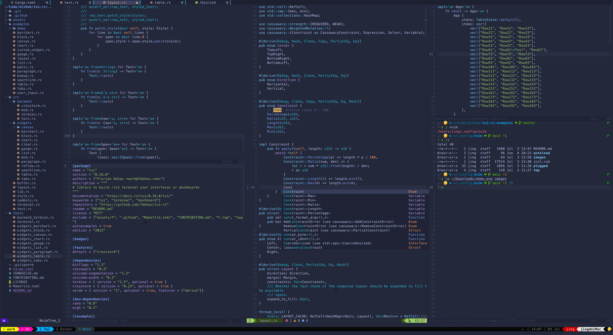

## 如何安装

### 克隆仓库
首先确保已经安装 [neovim](https://github.com/neovim/neovim/wiki/Installing-Neovim)

克隆本仓库

```bash
git clone git@github.com:KURANADO2/neovim-config.git --depth=1 ~/.config/nvim
```

### 插件安装

进入 neovim 执行

```bash
:PlugInstall
```

### 插件依赖安装

```bash
# nvim-telescope/telescope.nvim 所需依赖
brew install ripgrep
# kdheepak/lazygit.nvim 所需依赖
brew install jesseduffield/lazygit/lazygit
# davidgranstrom/nvim-markdown-preview
brew install pandoc
npm install -g live-server
# Esc 切换为英文输入法所需依赖
brew tap daipeihust/tap && brew install im-select
```

### 自动补全

neovim/nvim-lspconfig 自动补全

```bash
# Rust
brew install rust-analyzer
# Python
npm i -g pyright
# Lua
brew install ninja
# clone project
cd ~
git clone --depth=1 https://github.com/sumneko/lua-language-server
cd lua-language-server
git submodule update --depth 1 --init --recursive
cd 3rd/luamake
./compile/install.sh
cd ../..
./3rd/luamake/luamake rebuild
```

### 语法高亮

nvim-treesitter/nvim-treesitter 为指定语言开启语法高亮

```bash
:TSInstall c
:TSInstall java
:TSInstall go
:TSInstall rust
:TSInstall python
:TSInstall lua
```

## 快捷键

### 光标移动

快捷键|功能
-|-
`J`|向下移动 5 行
`K`|向上移动 5 行
`H`|移动到行首（行首不为空的字符处）
`L`|移动到行尾（行首不为空的字符处）
`⌃` `J`|向下翻页 5 行
`⌃` `K`|向上翻页 5 行

### 多光标

快捷键|功能
-|-
`⌃` `n`|选中相同单词
`⌃` `↑`|向上创建多光标
`⌃` `↓`|向下创建多光标

### 文件

快捷键|功能
-|-
`S`|保存文件
`Q`|关闭文件
`␣` `r` `c`|打开 `~/.config/nvim/init.nvim` 文件
`␣` `r` `s`|刷新 `~/.config/nvim/init.nvim` 文件

### 文件树

快捷键|功能
-|-
`t` `t`|打开/关闭文件树
`␣` `n`|在文件树中定位到当前获取焦点的文件

### 标签页切换

快捷键|功能
-|-
`E`|切换到左侧标签页
`R`|切换到右侧标签页
`W`|切换到最左侧标签页
`T`|切换到最右侧标签页

### 窗口分割

快捷键|功能
-|-
`s` `h`|向左侧分割出新窗口
`s` `j`|向下方分割出新窗口
`s` `k`|向上方分割出新窗口
`s` `l`|向右侧分割出新窗口
`s` `d`|将水平分割的窗口重新布局为垂直分割
`s` `f`|将垂直分割的窗口重新布局为水平分割

### 窗口大小

快捷键|功能
-|-
`←`|横向调整窗口大小
`→`|纵向调整窗口大小
`↑`|纵向调整窗口大小
`↓`|横向调整窗口大小

### 窗口切换

快捷键|功能
-|-
`␣` `h`|切换到左侧窗口
`␣` `j`|切换到下方窗口
`␣` `k`|切换到上方窗口
`␣` `l`|切换到右侧窗口

### 大小写

快捷键|功能
-|-
&#96;|大小写转换

### 高亮

快捷键|功能
-|-
`␣` `↩︎`|取消搜索高亮

### 搜索

快捷键|功能
-|-
`␣` `f` `f`|搜索文件名称
`␣` `f` `g`|搜索字符串
`␣` `f` `b`|搜索 Buffer
`␣` `f` `h`|搜索 Tag

### 书签

快捷键|功能
-|-
`m` `m`|打书签
`m` `a`|查看所有书签
`m` `a`|清除当前文件内所有书签
`m` `x`|清除所有文件的书签
`m` `n`|跳转到下一个书签
`m` `N`|跳转到上一个书签

### Git

快捷键|功能
-|-
`␣` `g` `g`|打开 Lazygit
`Q`|退出 Lazygit

### 输入法

快捷键|功能
-|-
`⎋`|切换到英文输入法（由 INSERT 模式切换到 NORMAL 模式）

### Markdown

快捷键|功能
-|-
`␣` `s` `r`|Markdown 预览

### 终端

快捷键|功能
-|-
`␣` `/`|打开终端
